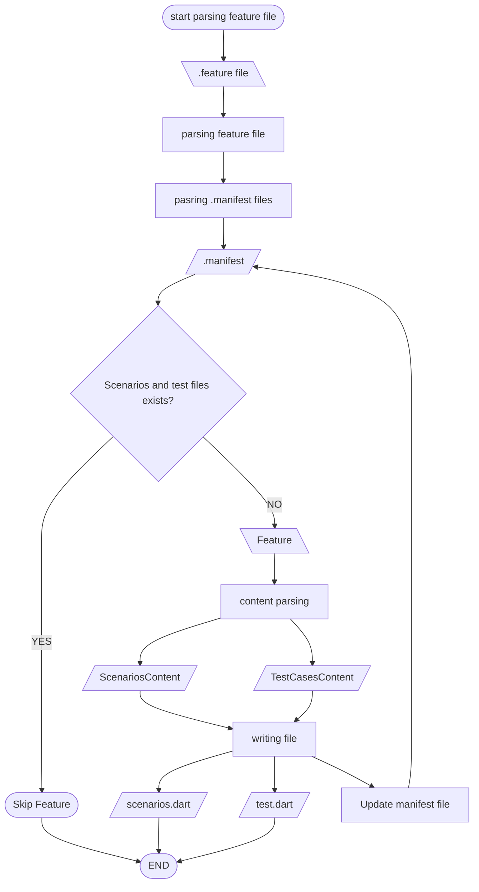

# Project Overview

This is an overview and guidance for developing `bdd_flutter` package and the structure of the code.

The `bdd_flutter` package is a powerful tool for Behavior-Driven Development (BDD) in Flutter. It simplifies the process of writing and maintaining tests by automatically generating test files from Gherkin feature files.

## Key Features

- **Automatic Test Generation**: Write your tests in Gherkin syntax, and let the package generate the corresponding Dart test files.
- **Incremental Updates**: Preserve your custom code during test file regeneration.
- **Customizable**: Configure the package to suit your project's needs.
- **Support for Both Widget and Unit Tests**: Choose the type of tests you want to generate.
- **Test Reporter**: Optionally enable a test reporter to get detailed test results.

## Flowchart

## Project layout

1. Parsing functionality

- Feature file parsing: parse feature file content into a Feature object
  - location: `lib/src2/feature/parsing/feature_parser.dart`
- Scenario file parsing: parse scenario classes from a Dart file into Content object
  - location: `lib/src2/feature/parsing/scenario_parser.dart`
- Test file parsing: parse test cases from a Dart file into Content object
  - location: `lib/src2/feature/parsing/test_case_parser.dart`

2. Content:

- Scenario content:
  - parsed from scenario Dart file
  - to be used to generate scenario Dart file
- Test case content: parsed from test file
  - to be used to generate test file
  - to be used to generate test file

3. File Processing

   - to read and write files

4. Builder

   - to parse CMD

## Project Structure

- Domain layer
  - Feature
  - Scenario
  - Step
  - Content
  - Decorator
- Parsing layer
  - FeatureParser
  - ScenarioParser
  - TestCaseParser
- File processing layer
  - DartFileWriter
  - DartFileReader
- Builder layer
  - BuildCommand
  - CommandParser
- CLI layer
  - CLILogger
  - CLIHelp
- Config layer
  - ConfigManager
- Manifest layer
  - ManifestManager
  - ManifestParser
